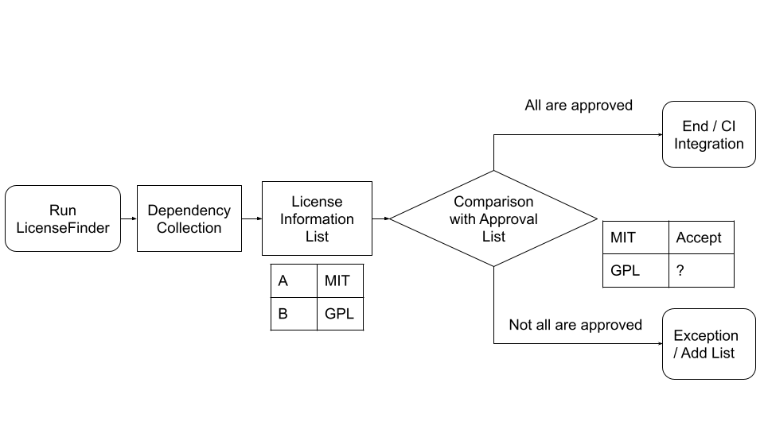

## What is LicenseFinder

LicenseFinder is an open-source tool that identifies the licenses of your project’s dependencies. It scans your project’s package manager and the installed packages, determines which licenses are in use, and generates a report listing all detected licenses.

LicenseFinder supports multiple package management tools like Pip, npm, Bundler, Maven, and others. You can find the full list here:  
https://github.com/pivotal/LicenseFinder

LicenseFinder also offers the advantage of easy integration into CI/CD pipelines.  
It automatically performs license checks during builds and can flag unapproved licenses as errors. 
Furthermore, reports can be exported in multiple formats such as text, CSV, JSON, and HTML, making them convenient for sharing with legal and compliance departments.  

In this tutorial, we will focus specifically on **license management** for Python projects and learn how to use LicenseFinder.

The following diagram illustrates the LicenseFinder workflow:

When LicenseFinder starts up, it collects all dependencies used in the project by checking the project’s package manager and the installed packages. It then organizes their license information into a list. Finally, it checks which licenses are permitted by comparing them against the approval list defined by the user.

With this background in mind, let’s now explore how to use LicenseFinder in practice and learn step by step how it can simplify dependency license management.