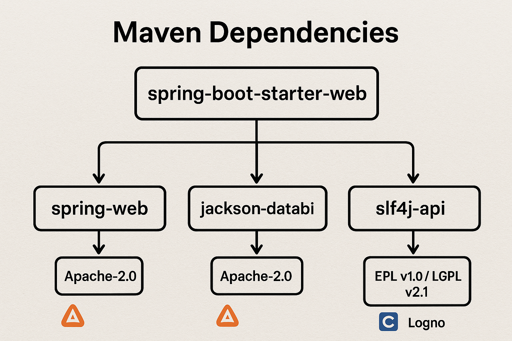

## LicenseFinder: What It Is and Why Use It?

If you're like me and have ever worked with a dependency management tool like Maven or npm, you know how easy it is to add dependencies to a project.  
However, if you've ever checked which dependencies rely on other dependencies, you quickly realize that adding just one can pull in many more since one dependency can depend on multiple others.

LicenseFinder can find all the software licenses for those dependencies. It scans your codebase, identifies what you're using, and spits out a report showing all the licenses hiding in there.

We do this to stay out of legal trouble or to avoid costs that could be incurred by using a dependency that isn't free to use.
Or using a dependency that we don't have the license to use.

License Finder supports multiple package management tools like pip, npm, Bundler, maven etc. You can find the full list here:  
https://github.com/pivotal/LicenseFinder

For this tutorial, we're going to focus on managing software licenses using LicenseFinder in a Maven project.
